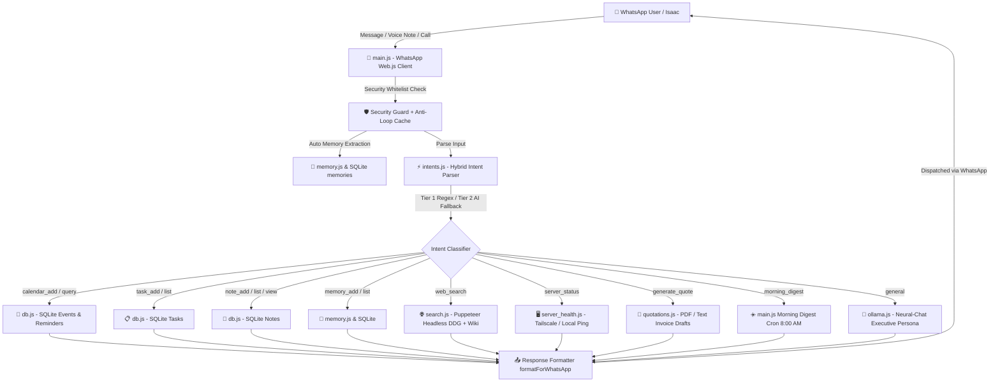

# 🤖 JARVIS AI — Autonomous WhatsApp Executive Assistant & Infrastructure Control Node

> **Owner:** Isaac David Christopher | **Business:** Creative Clicks Studios  
> **Tech Stack:** Node.js (v22+) • WhatsApp Web.js • Ollama (`neural-chat`) • SQLite3 • Puppeteer Core (Chromium) • Google Calendar API • Docker & Systemd  
> **Timezone:** Asia/Kuala_Lumpur (`UTC+08:00`)

---

## 📌 Project Overview

**JARVIS AI** is a 24/7 self-hosted, autonomous personal assistant and executive control system operating over WhatsApp. Designed specifically for Isaac's daily workflow as an IT student, media producer, head of Creative Clicks Studios, and drummer, JARVIS connects local LLM intelligence with real-world infrastructure, sqlite databases, live web scraping, and proactive multi-stage notification crons.

---

## 🏗️ System Architecture



---

## 🔥 Key Features & Capabilities

### 1. 📅 Multi-Stage Event Calendar & Proactive Reminders
- **Relative Date Engine**: Accurately resolves natural relative dates (`"tuesday next week"`, `"This Sunday"`, `"tomorrow"`, `"day after tomorrow"`, `"in 3 days"`, `YYYY-MM-DD`, `DD/MM/YYYY`, `July 31st`) without UTC day shifting.
- **Clean Title Extraction**: Automatically strips action words (`Add event`, `Schedule`), date phrases, and time ranges (`3pm - 5pm`, `7:30am to 12pm`).
- **3-Stage Proactive Reminders**:
  - **Stage 1 (Day-Of Morning)**: Fires on the day of the event (`☀️ TODAY'S EVENT REMINDER`).
  - **Stage 2 (2 Hours Before)**: Fires 120 minutes in advance (`⏳ STARTING IN ~2 HOURS`). Notifies clients automatically if a contact phone number is provided.
  - **Stage 3 (Imminent Start)**: Fires 15–30 minutes before start time (`🔴 STARTING NOW / SOON`).

### 2. 🌐 Puppeteer Live Web Search Engine
- **Headless Chromium Primary Engine**: Bypasses bot/CAPTCHA blocks using headless Google Chrome/Chromium (`search.js`) to scrape real-time DuckDuckGo HTML.
- **Clean Organic Extraction**: Filters out ads/sponsored content, extracts titles, snippets, and unescaped target URLs (`uddg=`).
- **Multi-tier Fallbacks**: Fallback to DuckDuckGo Instant Answer API and Wikipedia API.
- **AI Executive Summary + Clickable Sources**: Summarizes findings via Ollama and appends direct URLs (`🔗 Top Sources`).

### 3. 🧠 Smart Hybrid Natural Language Understanding
- **Tier 1 (Instant Regex)**: Sub-millisecond matching for common spoken phrasing (e.g. *"Got a shoot with Sarah Saturday 3pm"*, *"Need to buy drumsticks tomorrow"*).
- **Tier 2 (AI Intent Classification Fallback)**: Queries local LLM if regex returns `general` for non-trivial messages to classify intent into one of 9 system categories.

### 4. 📝 Interactive Notes Catalog & Reader
- **Catalog Index**: Commands like `show notes` or `my notes` return a clean, un-cluttered numbered catalog index (`1️⃣ Mistral AI [ID: #3]`).
- **Individual Reader**: Command `view note 1` or `note 3` retrieves and displays full detailed note content.

### 5. 🧠 Persistent Memory & Preference Learning
- **Auto Memory Extractor**: Silently scans incoming chats to record preferences (e.g. *"Client Mark prefers PDF invoices"*).
- **Persistence**: Saved in SQLite database (`memories` table) and mirrored to `MEMORY.md`.

### 6. 🖥️ Infrastructure Health & Morning Digest
- **Server Health**: Pings multi-server architecture (`Friday` main production server, `Alpha` office server, `JARVIS` AI node).
- **Morning Digest**: Automated cron at 8:00 AM MYT summarizing today's events, pending tasks, and server statuses.

---

## 📁 File Structure & Component Map

| File / Folder | Role & Description |
| :--- | :--- |
| **`main.js`** | Core WhatsApp Web.js client entrypoint, message listener, typing indicators, anti-loop guards, reminder scheduler cron, morning digest cron. |
| **`intents.js`** | Hybrid Intent Classifier (Tier 1 Expanded Regex + Tier 2 Ollama AI Intent Fallback). |
| **`search.js`** | Fine-tuned multi-provider web search module (Puppeteer Chromium primary + DDG API + Wikipedia API). |
| **`db.js`** | SQLite database module (`personal.db`), migrations, relative KL date helper, multi-stage reminder queries. |
| **`calendar.js`** | Google Calendar API integration module. |
| **`memory.js`** | Auto-extraction memory learning engine, preference manager, `MEMORY.md` sync. |
| **`ollama.js`** | Axios interface to local Ollama API (`neural-chat` model). |
| **`quotations.js`** | Quotation and invoice generation module for Creative Clicks Studios. |
| **`server_health.js`** | Infrastructure monitoring & Tailscale ICMP/HTTP server status checker. |
| **`AGENT.md`** | Complete profile documentation for Isaac & JARVIS tone guidelines. |
| **`MEMORY.md`** | Human-readable log of learned memories & preferences. |
| **`personal.db`** | SQLite database storing events, tasks, notes, and memories. |
| **`docker-compose.yml`** | Docker deployment manifest combining Ollama and JARVIS AI container. |
| **`jarvisai.service`** | Systemd daemon service file for 24/7 background operation. |

---

## 🗄️ Database Schema (`personal.db`)

### `events` Table
```sql
CREATE TABLE events (
  id INTEGER PRIMARY KEY AUTOINCREMENT,
  title TEXT NOT NULL,
  event_date TEXT NOT NULL,
  start_time TEXT,
  end_time TEXT,
  description TEXT,
  recipient_phone TEXT,
  reminder_sent INTEGER DEFAULT 0,
  reminder_day_sent INTEGER DEFAULT 0,
  reminder_2h_sent INTEGER DEFAULT 0,
  created_at DATETIME DEFAULT CURRENT_TIMESTAMP
);
```

### `tasks` Table
```sql
CREATE TABLE tasks (
  id INTEGER PRIMARY KEY AUTOINCREMENT,
  text TEXT NOT NULL,
  completed INTEGER DEFAULT 0,
  reminder_sent INTEGER DEFAULT 0,
  created_at DATETIME DEFAULT CURRENT_TIMESTAMP
);
```

### `notes` Table
```sql
CREATE TABLE notes (
  id INTEGER PRIMARY KEY AUTOINCREMENT,
  title TEXT,
  content TEXT NOT NULL,
  created_at DATETIME DEFAULT CURRENT_TIMESTAMP,
  updated_at DATETIME DEFAULT CURRENT_TIMESTAMP
);
```

### `memories` Table
```sql
CREATE TABLE memories (
  id INTEGER PRIMARY KEY AUTOINCREMENT,
  category TEXT DEFAULT 'general',
  fact TEXT NOT NULL,
  created_at DATETIME DEFAULT CURRENT_TIMESTAMP
);
```

---

## 💬 Command & Natural Phrase Reference

| Intent | Natural Phrasing Example | Resulting Action |
| :--- | :--- | :--- |
| **Add Event** | `"Add event Badminton tuesday next week 3pm - 5pm"` | Schedules event on `2026-08-04` at `15:00` with 3-stage reminders. |
| **Add Event (Casual)** | `"Got a photo shoot with Sarah on Saturday at 3pm"` | Schedules event on `2026-08-01` at `15:00`. |
| **Add Task** | `"I need to buy new drumsticks tomorrow"` | Adds pending task `#1`. |
| **List Tasks** | `"show my tasks"` or `"my tasks"` | Returns numbered list of active tasks. |
| **Complete Task** | `"complete task 1"` | Marks task `#1` as completed. |
| **Add Note** | `"Save note named Mistral AI: [content]"` | Saves note titled `Mistral AI`. |
| **List Notes** | `"show notes"` or `"my notes"` | Displays catalog index of all saved notes. |
| **View Note** | `"view note 1"` or `"note 3"` | Displays full content of note #1 / #3. |
| **Web Search** | `"What is the latest AI model released in 2026?"` | Scrapes organic web, synthesizes summary & source links. |
| **Add Memory** | `"Client Mark prefers PDF invoices via WhatsApp"` | Saves preference to SQLite & `MEMORY.md`. |
| **Server Health** | `"Is server Friday running?"` or `"server status"` | Returns status of Friday, Alpha, and JARVIS. |
| **Morning Digest** | `"morning digest"` | Generates immediate executive briefing. |

---

## ⚙️ Environment & Running the System

### `.env` File Setup
```env
SESSION_ID=isaac_ai_session
PRIMARY_PHONE=60176001484
PRIMARY_USER_JID=60176001484@c.us
OLLAMA_URL=http://localhost:11434
TZ=Asia/Kuala_Lumpur
GOOGLE_APPLICATION_CREDENTIALS=./creds.json
```

### Running Locally
```bash
npm install
npm start
```

### Running via Systemd Daemon
```bash
sudo cp jarvisai.service /etc/systemd/system/
sudo systemctl daemon-reload
sudo systemctl enable --now jarvisai
```
